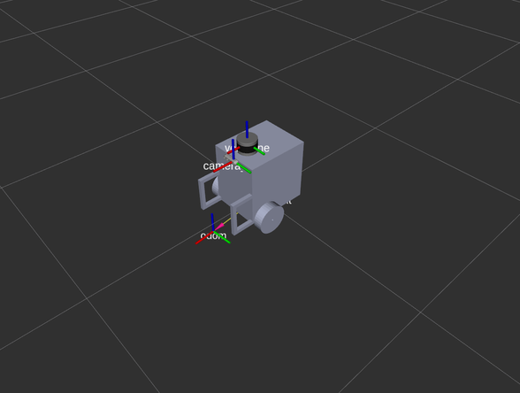
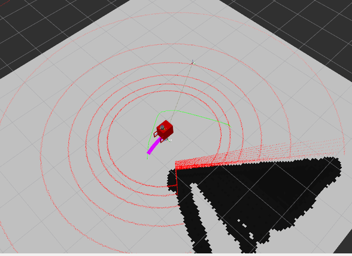

# guiding-robot-code
code for guiding robot, include tx2 and jetson nano parts

## How to run
When the robot power up, tx2 will set to ros master automatically. The things you need to do on tx2 is launching LiDAR sensor and 
launch motor controller and D435 on Jetson Nano.


## Gazebo
#### Requirements:
 -  $ sudo apt-get install ros-indigo-joint-state-controller
 -  $ sudo apt-get install ros-indigo-effort-controllers
 -  $ sudo apt-get install ros-indigo-position-controllers

#### Robot model
The robot model is available for 3D LiDAR sensing and differential drive motor control now.
```bash
PC$ roslaunch atbot_description gazebo.launch  
PC$ roslaunch atbot_description rviz.launch
```




